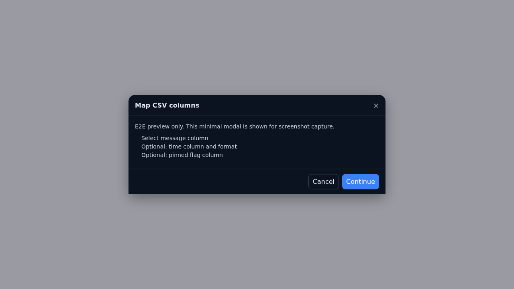

# CSV Import Mapping

Table of Contents
- Capabilities
- Tips
- Screenshots / GIFs

Where: Settings → Recent toasts → Import CSV.

[← Back to docs index](./README.md)

Capabilities
- Map CSV columns for Time, Message, and Pinned.
- Date formats: auto, epoch_ms, epoch_s, dd/MM/yyyy, MM/dd/yyyy, yyyy-MM-dd, ISO.
- Toggles persisted: “Treat blank time as now”, “Ignore blank messages” (localStorage `yc_csv_mapping`).
- Live stats: mapped rows count; invalid time samples highlighted with tooltip; parsed preview column.
- Import Preview summary: +M new, kept K, latest 10; drop‑count note when blanks ignored.
- Presets: save/apply, set default; import/export with Replace confirmation.

Tips
- If Message column is empty and “Ignore blank messages” is off, Continue is blocked.
- Use Sample JSON/CSV to understand structure; preview before applying replace/merge.

Screenshots / GIFs
- Place a screenshot/GIF at `docs/assets/csv-mapping.png|gif` and embed:
  ```md
  
  ```

---

Last updated: 2026-01-06
